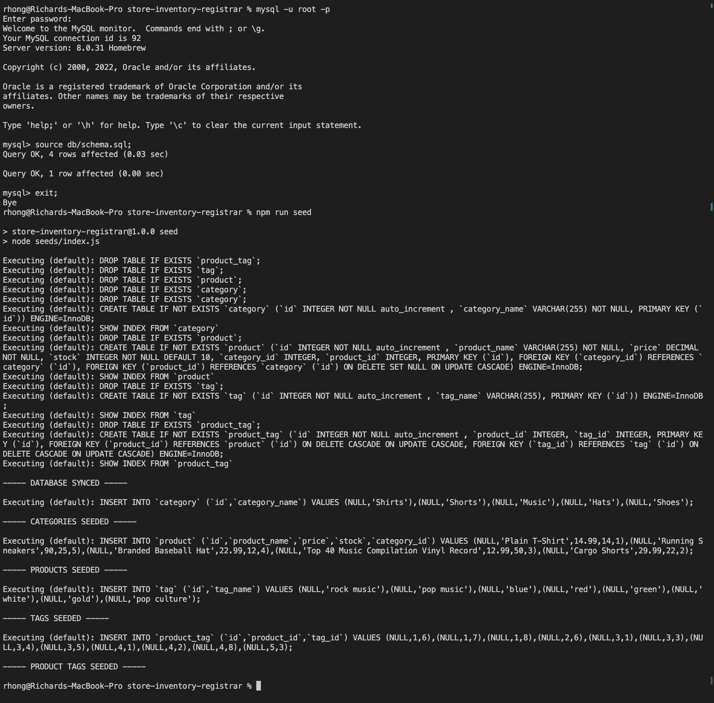
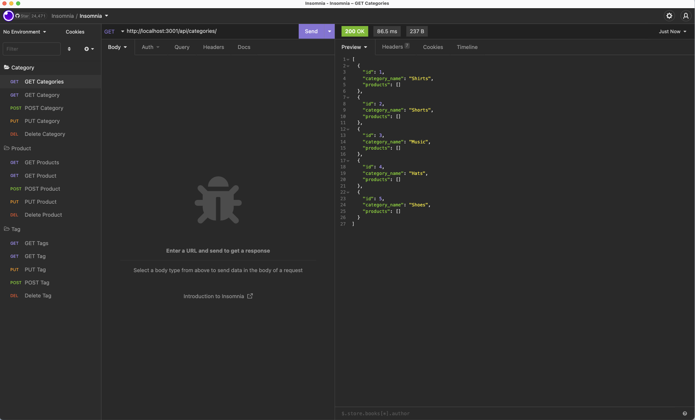

# Store Inventory Registrar

[](https://opensource.org/licenses/MIT)


## Description
This app gets, posts, puts (updates), and deletes a tag, a category, or a product from a SQL database depending on which api route and method are used.

## Technologies
This app is built with [Node.js](https://nodejs.org/en/), [Express](https://expressjs.com/) (version 4.17.1), [mysql2](https://www.npmjs.com/package/mysql2) (version 2.1.0), [sequelize](https://sequelize.org/) (version 5.21.7), [doteven](https://www.npmjs.com/package/dotenv) (version 8.2.0), and lastly [nodemon](https://www.npmjs.com/package/nodemon) (version 2.0.20) for convenience on restarting the server on fast iterative additions of code (NOTE: this is a dev dependency). [Insomnia](https://insomnia.rest/) was used for testing the API routes.

## Table of Contents
  - [Installation](#installation)
  - [Usage](#usage)
  - [Architecture](#architecture)
  - [Video Demo](#demo)
  - [Screenshot](#screenshot)
  - [License](#license)
  - [Improvements](#improvements)
  - [Questions](#questions)

## Installation

The user needs to have MySQL Server installed; instructions can vary based on the operating system. The following command can show if it is already installed:

```
mysql --version
```
After cloning the repository, the user should run the following command within the terminal:
```
npm install
```
Afterwards check towards the bottom within package.json; the user should see the following within the dependencies object:

```
...
  "dependencies": {
    "dotenv": "^8.2.0",
    "express": "^4.17.1",
    "mysql2": "^2.1.0",
    "sequelize": "^5.21.7"
  }
```

## Usage
After installing Express, mysql2, dotenv, mysql2, and sequelize, the user should create an .env file at the root level of the application directory. Within this .env file, there are four variables to store:
```
DB_NAME = 'ecommerce_db'
DB_USER='<USER>'
DB_PASSWORD='<PASSWORD>'
DB_HOST='localhost'
```

Next the user should run the following commands within the terminal:
```
mysql -u root -p
```
After inserting password, the user should run the following commands while in mysql to create the database:
```
source db/schema.sql;
exit;
```

Upon creating the database, the user should run the following commands to seed the database and get mock data:
```
npm run seed

``` 
Lastly, the user should run the following:
```
npm run start
```
After running the command, the user should expect to see something similar within his/her terminal:



## Architecture
For this program, the logic for the relations between the different Models was as follows:

* `Product` belongs to `Category`, and `Category` has many `Product` models, as a category can have multiple products but a product can only belong to one category.

* `Product` belongs to many `Tag` models, and `Tag` belongs to many `Product` models. Products have multiple tags and tags have many products by using the `ProductTag` through model.


## Demo
[Video demo](https://drive.google.com/file/d/1WGQviBv9whxE03RGlPH5ttuMPnEKY45c/view)

## Screenshot


## License
This app was licensed under the MIT License.

## Improvements
Refactoring the product put method into a try/catch block would be more consistent with the rest of api routes for error handling.

## Questions
Questions, comments, concerns? Send me an email at rhong24@gmail.com.

